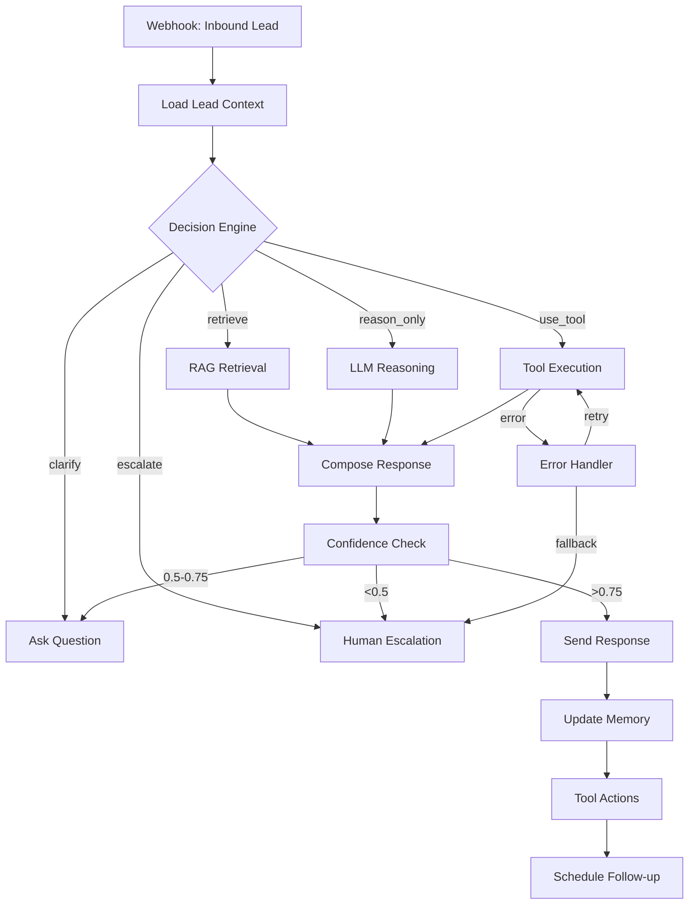

# Autonomous Business AI Agent - Sales & Operations PoC

## What Was Built

A production-ready **Autonomous AI Agent** (NOT a chatbot) designed for service businesses to handle sales and operations autonomously. This is a working Proof-of-Concept that demonstrates:

- **Autonomous decision-making** via LangGraph state machine
- **RAG-grounded responses** with conditional retrieval
- **Tool integrations** with error handling and fallbacks
- **Cross-session memory** (SQL + vector store)
- **Confidence scoring** with human escalation
- **Real autonomy** - the agent decides when to retrieve, reason, use tools, ask questions, or escalate

## Agent Role & Autonomy Level

**Role**: AI Sales & Operations Agent
**Autonomy Level**: High (Level 4/5)

The agent operates autonomously across the full sales cycle:
1. Receives inbound leads via webhook
2. Loads historical context from memory
3. **Decides** next action (retrieve/reason/tool/clarify/escalate)
4. Uses RAG to answer from knowledge base (SOPs, FAQs, pricing, policies)
5. Qualifies prospects based on criteria
6. Books meetings and sends follow-ups
7. Updates CRM with structured data
8. Escalates edge cases to humans when confidence is low

**Key Autonomy Feature**: Explicit decision node that evaluates:
- Query complexity
- Available context
- Confidence score
- Tool requirements
- Risk level

The agent does NOT always retrieve or always use tools - it reasons about what's needed.

## How RAG Is Implemented

### Pipeline Architecture

1. **Ingestion** (`rag/chunker.py`)
   - Chunks documents from `knowledge_base/` folder
   - Strategy: 600 token chunks, 100 token overlap
   - Rationale: Balances context preservation with retrieval precision

2. **Embeddings** (`rag/embeddings.py`)
   - Abstracted provider interface (OpenAI default, swappable)
   - Caches embeddings to avoid redundant API calls

3. **Vector Store** (`memory/semantic.py`)
   - ChromaDB for local development
   - Metadata filters: doc_type, updated_at, category
   - Persistent storage in `./data/chroma/`

4. **Retrieval** (`rag/retriever.py`)
   - Top-k: 8 chunks by default
   - Metadata filtering by document type
   - Returns structured Evidence objects

5. **Re-ranking** (`rag/reranker.py`)
   - Hybrid: cosine similarity + recency + source quality
   - Boosts recent docs and high-authority sources

6. **Grounding** (`agent/nodes.py:compose_response`)
   - Responses cite source evidence
   - Confidence degraded if sources conflict or are weak
   - Empty retrieval → asks clarifying question or escalates

### Conditional Retrieval

RAG is **not always on**. The decision engine (`agent/decision_engine.py`) determines if retrieval is needed based on:
- Query requires factual lookup (pricing, policies, procedures)
- Insufficient context in conversation history
- Confidence score below threshold after initial reasoning

Simple conversational queries (greetings, confirmations) skip retrieval.

## Architecture



## Tech Stack

- **Agent Framework**: LangGraph (state machine with persistence)
- **LLM**: Abstracted provider (OpenAI GPT-4, Claude, Gemini)
- **RAG**: ChromaDB (vector store) + custom retrieval pipeline
- **Backend**: FastAPI (Python 3.11+)
- **Memory**:
  - Factual: SQLite (CRM data, lead status, notes)
  - Semantic: ChromaDB (conversation history, embeddings)
- **Tools**: Mock CRM, Calendar (Google Calendar API interface), Email (SMTP/SendGrid)
- **Jobs**: APScheduler (follow-ups, periodic tasks)
- **Observability**: Structured JSON logs + trace IDs

## Scale Assumptions

**Current PoC Scale**:
- 100-500 leads/month
- <10 concurrent conversations
- Local ChromaDB (<100k documents)
- SQLite for transactional data
- Mock tool integrations

**Production Scale Path** (see `docs/scaling_roadmap.md`):
- 10k+ leads/month
- 100+ concurrent conversations
- Pinecone/Weaviate for vector store
- PostgreSQL for CRM data
- Real API integrations (HubSpot, Calendly, SendGrid)
- Kubernetes deployment
- Redis for session state
- OpenTelemetry for observability

## Project Structure

```
autonomous-agent/
├── agent/              # LangGraph orchestration, decision engine, nodes
├── rag/                # RAG pipeline (chunking, embeddings, retrieval, reranking)
├── tools/              # Tool abstractions (CRM, Calendar, Email)
├── memory/             # Factual (SQL) + Semantic (vector) memory
├── integrations/       # LLM provider abstraction
├── observability/      # Structured logging with trace IDs
├── api/                # FastAPI app and routes
├── jobs/               # Background job scheduler
├── knowledge_base/     # SOPs, FAQs, pricing, policies (markdown)
├── docs/               # Architecture, design, scaling docs
└── examples/           # Example runs and test scenarios
```

## Quick Start

### Prerequisites
```bash
python 3.11+
pip
```

### Installation

```bash
# Clone and navigate
cd autonomous-agent

# Install dependencies
pip install -r requirements.txt

# Set up environment variables
cp .env.example .env
# Edit .env with your API keys
```

### Environment Variables

Required in `.env`:
```
# LLM Provider (choose one)
OPENAI_API_KEY=sk-...
ANTHROPIC_API_KEY=sk-...
GOOGLE_API_KEY=...

# LLM Configuration
LLM_PROVIDER=openai  # or anthropic, google
LLM_MODEL=gpt-4-turbo-preview

# Embeddings
EMBEDDING_PROVIDER=openai
EMBEDDING_MODEL=text-embedding-3-small

# Database paths
DATABASE_URL=sqlite:///./data/agent.db
CHROMA_PERSIST_DIR=./data/chroma

# API Configuration
API_HOST=0.0.0.0
API_PORT=8000

# Tool Configuration (for production - currently mocked)
# SENDGRID_API_KEY=...
# GOOGLE_CALENDAR_CREDENTIALS=...
# HUBSPOT_API_KEY=...
```

### Initialize Knowledge Base

```bash
# Ingest knowledge base documents
python -m scripts.ingest_knowledge
```

### Run the Agent

```bash
# Start FastAPI server
uvicorn api.app:app --host 0.0.0.0 --port 8000 --reload
```

API will be available at `http://localhost:8000`

Docs at `http://localhost:8000/docs`

### Run Example Scenarios

```bash
# Test with pre-built scenarios
python examples/test_scenarios.py
```

## API Endpoints

### POST `/webhook/lead`
Receives inbound lead from website form, email, or integration.

```json
{
  "email": "prospect@company.com",
  "name": "John Doe",
  "message": "I need pricing for your enterprise plan",
  "source": "website_form",
  "metadata": {
    "company": "Acme Corp",
    "phone": "+1-555-0123"
  }
}
```

### GET `/health`
Health check endpoint.

### GET `/agent/status/{lead_id}`
Get current status and conversation history for a lead.

## Example Runs

See `examples/example_runs.md` for detailed walkthroughs:

1. **Pricing inquiry** → RAG retrieval → accurate quote
2. **Lead qualification** → tool use → CRM update
3. **Policy conflict** → low confidence → escalation
4. **Calendar booking failure** → error handling → fallback to manual scheduling

## Key Implementation Highlights

### 1. Autonomous Decision-Making
`agent/decision_engine.py:decide()` - Returns explicit action enum:
- `RETRIEVE` - needs factual lookup
- `REASON_ONLY` - can answer from context
- `USE_TOOL` - requires tool execution
- `CLARIFY` - needs more info from user
- `ESCALATE` - beyond agent capability

### 2. Tool Error Handling
`tools/base.py:ToolResult` - Structured success/failure:
```python
@dataclass
class ToolResult:
    success: bool
    data: Optional[Dict]
    error: Optional[str]
    retry_allowed: bool
```

Agent retries transient failures, escalates permanent failures.

### 3. RAG Grounding
`agent/nodes.py:compose_response()` - Validates evidence quality:
- Rejects weak sources (score < 0.6)
- Detects conflicting information
- Cites sources in response
- Degrades confidence if evidence is poor

### 4. Cross-Session Memory
- **Factual**: `memory/factual.py` - SQL schema for leads, contacts, notes
- **Semantic**: `memory/semantic.py` - Vector store for conversation history
- Loads context on each session start
- Updates after each interaction

### 5. Confidence & Escalation
`agent/decision_engine.py:calculate_confidence()` - Scores 0-1:
- ≥0.75: proceed with answer
- 0.5-0.75: ask clarifying question
- <0.5: escalate to human

Factors: source quality, query complexity, tool success, conflict detection

## Testing

```bash
# Run unit tests
pytest tests/

# Test specific scenario
python examples/test_scenarios.py --scenario pricing_inquiry
```

## Deployment

### Docker (Recommended for Production)

```bash
# Build image
docker build -t autonomous-agent:latest .

# Run with docker-compose
docker-compose up -d
```

### Manual Deployment

See `docs/deployment.md` for:
- Environment setup
- Database initialization
- Process management (systemd/supervisor)
- Reverse proxy (nginx)
- SSL certificates
- Monitoring setup

## Documentation

Comprehensive docs in `docs/`:
- **architecture.md** - System design and component interactions
- **decision_logic.md** - How the agent decides what to do
- **rag_design.md** - RAG pipeline details and tradeoffs
- **risks_and_mitigations.md** - Known limitations and mitigations
- **scaling_roadmap.md** - Path to production scale

## Observability

All agent runs produce structured logs:
```json
{
  "trace_id": "abc-123",
  "timestamp": "2024-01-07T10:30:00Z",
  "event": "decision_made",
  "decision": "retrieve",
  "confidence": 0.82,
  "reasoning": "Query requires pricing lookup",
  "retrieved_sources": ["pricing/enterprise.md", "faqs/pricing.md"],
  "tool_calls": [],
  "escalated": false
}
```

Logs include:
- Decision outputs
- Retrieved sources with scores
- Confidence scores
- Tool calls and results
- Escalation events
- Error traces

## License

MIT

## Support

For issues, questions, or contributions, see `CONTRIBUTING.md`.
---

## Note on Usage

This repository is provided as a portfolio proof-of-concept demonstrating autonomous agent architecture, decision logic, and RAG patterns.

It is not intended to be a drop-in production system without adaptation, configuration, and domain-specific integration.
